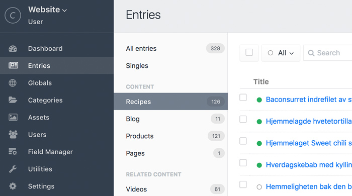

# CP Element Count plugin for Craft CMS 3.x

Shows you the number of elements - Entries, Assets, Categories and Users - right
there, in the control panel. 

## Requirements

This plugin requires Craft CMS 3.0.0 or later.

## Installation

To install the plugin, follow these instructions.

1. Open your terminal and go to your Craft project: `cd /path/to/project`
2. Then tell Composer to load the plugin: `composer require aelvan/craft-cp-element-count`
3. In the Control Panel, go to Settings → Plugins and click the “Install” button for CP Element Count.

Brought to you by [André Elvan](https://www.vaersaagod.no/)
